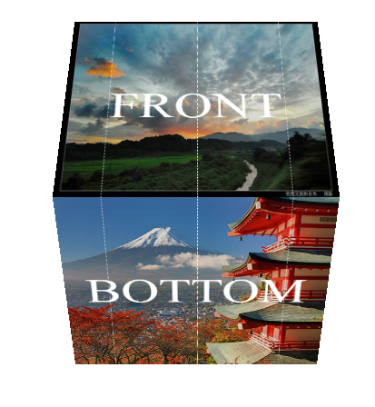
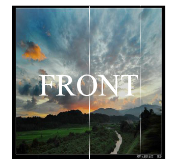

# 3d-cube

自下往上旋转

分为front、top、back、bottom四面可见

动画初始

# 总结
3d动画的实现：
1.父元素设置perspective
2.设置transform-style： preserve-3d；
3.添加各种动画效果 例如transform： translateZ(-150px) rotateX(0deg)
animation: example 15s linear infinite;

#特别留意
translateX 负值是向左平移 正值向右
translateY 负值向上 正直向下
rotateX 自下往上旋转
rotateY 自右往左旋转
